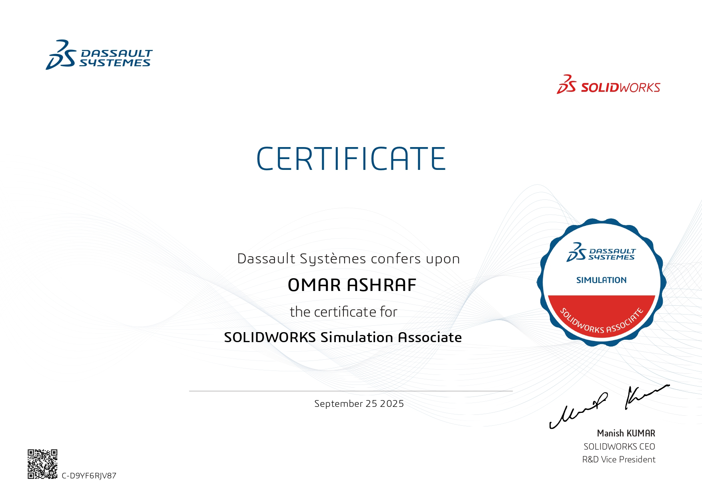

# CSWA-Simulation Prep Guide 🎓

A comprehensive collection of personal notes, solved problems, and key resources to help you prepare for and pass the **Certified SOLIDWORKS Associate - Simulation (CSWA-S)** exam.

---

## 📜 About This Project

After successfully passing the CSWA-Simulation exam, I created this repository to share the materials and insights I gathered during my preparation. The goal is to provide a clear, structured, and helpful resource for other students and professionals aiming to achieve this certification.

This guide is built upon the curriculum of the "Become a SOLIDWORKS Simulation Associate Today!" course on Udemy and my personal study notes.

---

## 🏆 My Achievement

I have successfully earned the **Certified SOLIDWORKS Associate - Simulation (CSWA-S)** certification.

  

  

---

## 🗂️ Repository Structure

To make navigation easy, the repository is organized into the following directories:
├── 📄 README.md
├── 📄 IMPORTANT_LINKS.md       <-- Curated list of external resources
│
├── 🧠 THEORY/
│   ├── Core_Concepts/          <-- In-depth notes on FEA principles
│   └── Theoretical_Questions/  <-- Q&A for the exam's theory part
│
├── 📝 MY_NOTES/
│   └── ...                     <-- My personal notes and insights
│
└── 🛠️ PRACTICE_PROBLEMS/
├── Section_04/             <-- Cases & Quizzes for Section 4
├── Section_05/             <-- Cases & Quizzes for Section 5
└── ...                     <-- And so on for all sections

---

## 🤝 Contributing

Contributions are welcome! If you have additional notes, new problems, or helpful resources, please feel free to contribute.

1.  Fork the Project
2.  Create your Feature Branch (`git checkout -b feature/NewProblem`)
3.  Commit your Changes (`git commit -m 'Add new static analysis problem'`)
4.  Push to the Branch (`git push origin feature/NewProblem`)
5.  Open a Pull Request

---

## ⚖️ License

This project is distributed under the MIT License. See the `LICENSE` file for more information.

---
